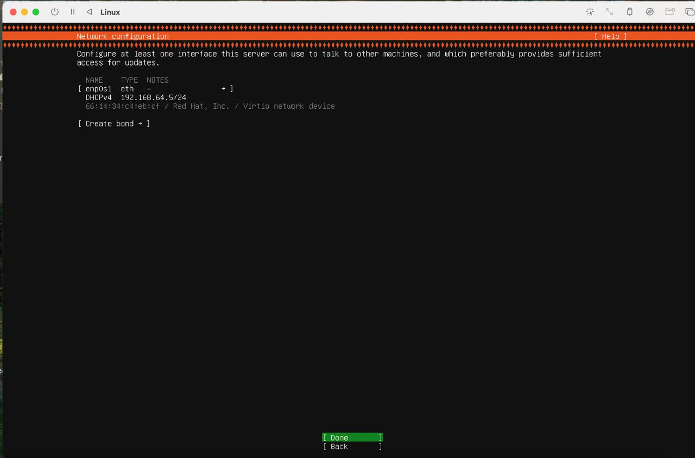
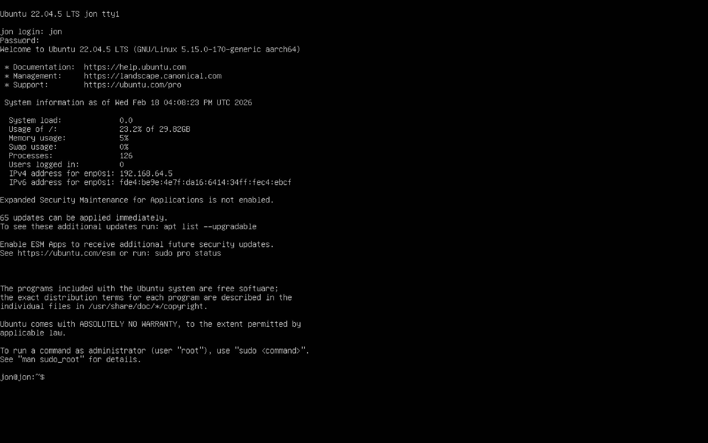
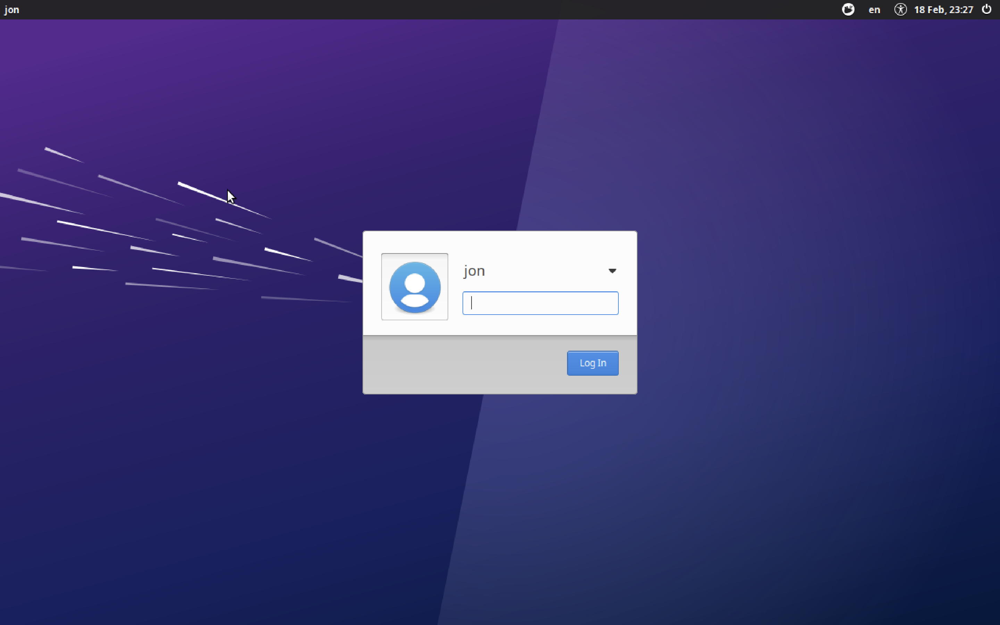
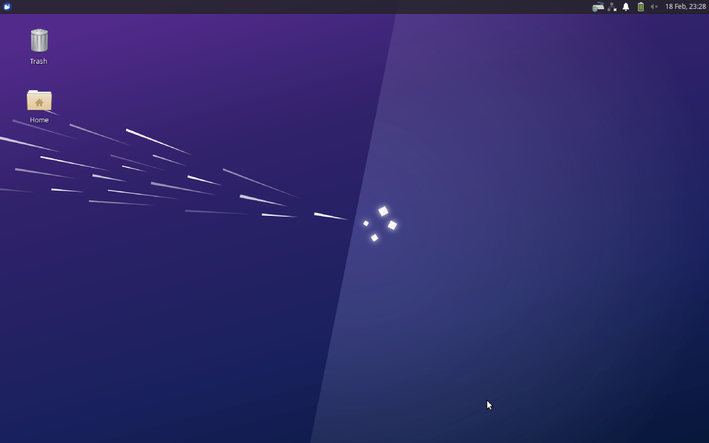

# Ununtu 22.04 on macOS
This README explains how to properly install Ubuntu 22.04 with UTM on macOS for the use in the BRT-CARLA setup. 

(Tested on M1 (arm64) processor but is applicable for Intel. Differences in steps are explained)

## Requirements
- macOS (Intel or Apple Silicon)
- At least 8 GB RAM, 16 GB recommended
- Recommended 64 GB free disk space, minimum 20 GB (after installation, VM will only use between 7-13 GB, depending if you want to use VM with a desktop or terminal only)
- Stable internet connection

## Get UTM
UTM is a virtualizition and emulation app for macOS that enables us to use other operating systems. Get UTM from https://mac.getutm.app/

Download it from the website, don't get the App Store version.

After the download is complete go into your donwload folder and install the UTM.dmg.

When it is done, verify it is compatible with your architecture by opening the terminal (command+Spacebar, type terminal) and running:
```bash
file /Applications/UTM.app/Contents/MacOS/UTM
```
you should see something like:
```text
/Applications/UTM.app/Contents/MacOS/UTM: Mach-O universal binary with 2 architectures: [x86_64:Mach-O 64-bit executable x86_64] [arm64]
/Applications/UTM.app/Contents/MacOS/UTM (for architecture x86_64):	Mach-O 64-bit executable x86_64
/Applications/UTM.app/Contents/MacOS/UTM (for architecture arm64):	Mach-O 64-bit executable arm64
```
Normally it downoads the universal binary with 2 architectures as you can see in the first line. This is compatible with arm64 and x86_64. In the second and third line you can see that both are avalible. If you see your architecture, you're fine. If you don't know your architecture check [here](#check-architecture).

### Give UTM premission to access files
1. Open system settings
2. Go to Privacy and Security in the list on the left
3. Click on Full Disk Access
4. UTM should be listed, enable the switch so it's green 

## Get Ubuntu 22.04
You can get the disk image for ubuntu-22.04-live-server from the ubuntu website. You won't find them if you go to the official website through the browser, but you can get it from:
```text
https://cdimage.ubuntu.com/releases/jammy/release/ubuntu-22.04.5-live-server-arm64.iso
```
for arm64,

or from:
```text
dunno (figure out and update)
```
for x64/Intel architecture.

Or get it from BRT-Teams

Now you should have a .iso file with the name: "ubuntu-22.04.5-live-server-arm64.iso" or "ubuntu-22.04.5-live-server-amd64.iso" depending on the architecture. Make sure the architecture in the file name matches the architecture of your device.

<a id="check-architecture"></a>
If you are unsure what architecture your device is, open terminal and run:
```bash
uname -m
```

## Setup Ubuntu in UTM
### Setup UTM
#### 1. Add a new virtual machine


- Click Create a New Virtual Machine

#### 2. Choose Virtualize


- Click Virtualize

#### 3. Choose Linux


- Click Linux

#### 4. Hardware


- Give the VM a minimum of 4GB RAM, if your device has 16GB RAM you can increase it to 8GB. (This won't reserve 4 GB or 8 GB respectively, from your device for the VM, but is the maximum amout of RAM the VM could use)
- Everything else same as seen in image

#### 5. Choose Boot Option


- Leave Apple virtualization unchecked
- Choose Boot from ISO image (file you downloaded earlier)
- Click on Browse... and select the .iso file you downloaded in the finder
- Click continue

#### 6. Storage


- By default set to 64GB, recommended to leave like this. This is the size of the virtual disk. That means the VM can at most use 64 GB of storage, but if it's smaller, the rest is still available for your device.

#### 7. Shared Directory


- Don't connect a path, leave it as is.

#### 8. Summary


- Click save

#### 9. See VM in UTM


- You will see the new VM on the left
- It will be called Linux and has the Penguin logo
- Make sure it's selected (blue) and scroll to bottom
- Verify CD/DVD is selected and on the right of it, it says the file name
- the click on the play symbol

### Setup Ubuntu
A second window will open in a command line style.


- Press enter on Try or Install Ubuntu Server
- Wait for it to load

#### 1. Select language


- choose whatever language you like, BUT all BRT documentation will be with english language

#### 2. Update Request


- Select Continue without updating

#### 3. Set Keyboard Setting


- navigate to [ Identify Keyboard ] with the arrow keys
- press ok
- it will request you to write * on your keyboard (Swiss layout Shift + 3)
- It will automatically recognize the swiss layout
- At Variant you can choose what variant of the layout you want (recommended: Switzerland - German/French (Switzerland, no dead keys))
- navigate to [ Done ] and press enter

#### 4. Choose Installation Type


- Choose Ubuntu Server (leave as is)
- Done

#### 5. Network Configuration


- Leave as is
- Done

#### 6. Proxy Address


- Leave blank
- Done

#### 7. Ubuntu Config


- Will load some packages
- when it says Reading package list... ; Select Done

#### 8. Storage Config


- Leave as is
- Done


- Done
- Warning will appear. This warning only applies to the virtual disk inside the VM, not to your disk from your real device. You can continue without worries

#### 9. Create User


- Create a user for your Ubuntu VM
- You will need the username and password to log into the VM when you start it and when you do administrative tasks. Pick a password thats safe and you remeber.
- Done

#### 10. Upgrade Ubuntu


- You don't need to upgrade, leave as is
- Done

#### 11. SSH Configuration


- Select install OpenSSH server
- Done

#### 12. Feature Server Snaps


- You don't need any feature server snaps
- Done

#### 13. Installation


- An installation window will start
- Wait until it says Installation complete!
- Select Reboot
- Reboot will get stuck because .iso file is still attached
- Shut down VM with shut down symbol on top left


- Warning will appear
- Click OK

#### 14. Remove ISO Image


- Choose your VM that you just installed
- Scroll down and click on CD/DVD
- Click clear

#### 15. Restart VM

- Restart VM by clicking on play symbol
- A boot image will apear and after it will say Display output is not active
- Wait for 10 - 20 seconds
- Terminal will apear


- Use your username and password to login



- Congratulation, you now have a Ubuntu 22.04.5 VM on your macOS!

### First Steps in Ubuntu

Now you will install everything you need to have a easy to use and BRT-CARLA-Setup compatible Ubuntu Setup

#### Update the system
Run:
```bash
sudo apt update
sudo apt upgrade -y
```
A window will promt you what you want to upgrade. Just go down and continue.

Then reboot once:
```bash
sudo reboot
```

#### Setup SSH from Mac terminal into VM
Now we will make a connection from our Mac terminal into the Virtual Machine. Why? This allows us to access the VM from macOS through the terminal. It makes it much easier because this way you can copy-paste commands from, e.g. this readME, to the VM. It also gives you a better terminal, less RAM usage and therefore a faster VM.

Find the VM IP.

Inside Ubuntu VM:
```bash
ip a
```
Look for something like:
```bash
192.168.64x/xx   (e.g. 192.168.64.5/24)
```
Then in Mac terminal:
```bash
ssh username@192.168.64.x (e.g. 192.168.64.5)
```
You will get a message like this:
```text
The authenticity of host '192.168.64.x (192.168.64.x)' can't be established.
ED25519 key fingerprint is SHA256:w6an/Q0AeTq6+I+3bUh6U8s0E4liT9T8cgcZjOnxh0c.
This key is not known by any other names.
Are you sure you want to continue connecting (yes/no/[fingerprint])?
```
Type "yes"

It will ask you for a password. Enter the password you set for the Ubuntu VM. Now, it will connect you to your Ubuntu virtual machine.

Your command line should look like:
```bash
servername@username:~$ 
```
Continue setup from here.

#### Install Docker
First install the required packages:
```bash
sudo apt update
sudo apt install -y ca-certificates curl gnupg
```
Now add Dockers official GPG key
```bash
sudo install -m 0755 -d /etc/apt/keyrings
curl -fsSL https://download.docker.com/linux/ubuntu/gpg | sudo gpg --dearmor -o /etc/apt/keyrings/docker.gpg
sudo chmod a+r /etc/apt/keyrings/docker.gpg
```
Then Add Docker Repository:
```bash
echo \
  "deb [arch=$(dpkg --print-architecture) signed-by=/etc/apt/keyrings/docker.gpg] https://download.docker.com/linux/ubuntu \
  $(. /etc/os-release && echo "$VERSION_CODENAME") stable" | \
  sudo tee /etc/apt/sources.list.d/docker.list > /dev/null
``` 
Next, install docker engine and compose plugin:
```bash
sudo apt update
sudo apt install -y docker-ce docker-ce-cli containerd.io docker-buildx-plugin docker-compose-plugin
``` 
Enable docker and allow user to run it:
```bash
sudo systemctl enable docker
sudo usermod -aG docker $USER
``` 
You do not need to replace ```$USER```, it automatically refers to your current username.

Now log out with:
```bash
exit
```
and log back in with the SSH connection:
```bash 
ssh username@192.164.64.x
```
Now test if docker works. Pull the official hello world into your docker with:
```bash
docker pull hello-world
```
Then run:
```bash
docker run hello-world
```
You should get a message from Docker:
```text
Hello from Docker!
This message shows that your installation appears to be working correctly.
...
```
Check docker version with:
```bash
docker compose version
```
Should be ```v5.x.x```

#### Install Python
Get Python by running:
```bash
sudo apt update
sudo apt install -y python3-venv python3-pip git build-essential
```
Create a clean Python environment for CARLA developement with:
```bash
python3 -m venv ~/venvs/carla
source ~/venvs/carla/bin/activate
python -m pip install --upgrade pip wheel setuptools
```
The CARLA Python API is not avalible as a pip install on arm architecture. You will use it through connecting with the workstation and using the API there.

If you are using x86/64 architecture install CARLA Python API by running:
```bash
pip install carla
```
Verify through importing it with:
```bash
python -c "import carla; print(carla)"
```
Your carla api installation was successful if you get:
```text
<module 'carla' from 'path_to_venv/carla-venv/lib/python3.10/site-packages/carla/__init__.py'>
```

#### Optional: Install Desktop
If you preffer to use your VM with a desktop, you can install one easily through the terminal. This will make your VM use more storage and more RAM if the desktop is running. It is not nessecary for the use in the BRT-CARLA-Setup.

Install XFCE (Xubuntu-style):
```bash
sudo apt install xubuntu-desktop -y
```
This is a lightweight desktop optimal for our VM. During installation it will prompt you if you want to install it with ```gdm-3``` or ```lightdm```. Choose ```lightdm```.

Then, enable graphical boot so VM boots automatically into desktop:
```bash 
sudo systemctl set-default graphical.target
```

Now reboot the VM. It will automatically.



After you login it will ask you if you want to update your Ubuntu version. Say no.



Now you have a desktop interface with your VM.
