# Ununtu 22.04 on macOS
This README explains how to properly install WSL2 and Ubuntu 22.04 for the use in the BRT-CARLA setup. 

(Tested on M1(arm64) processor but is applicable for Intel. Differences in steps are marked)

## Get UTM
UTM is a virtualizition and emulation app for macOS that enables us to emulate other operating systems. Get UTM from https://mac.getutm.app/

Download it from the website, don't get the App Store version.

After the download is comlete go into your donwload and install the UTM.dmg.

When it is done, verify it is compatible with your architecture by opening the terminal (command+Spacebar, type terminal) and running:
```bash
file file /Applications/UTM.app/Contents/MacOS/UTM
```
you should see something like:
```text
/Applications/UTM.app/Contents/MacOS/UTM: Mach-O universal binary with 2 architectures: [x86_64:Mach-O 64-bit executable x86_64] [arm64]
/Applications/UTM.app/Contents/MacOS/UTM (for architecture x86_64):	Mach-O 64-bit executable x86_64
/Applications/UTM.app/Contents/MacOS/UTM (for architecture arm64):	Mach-O 64-bit executable arm64
```
Normally it downoads the universal binary with 2 architectures as you can see in the first line. This is compatible with arm64 and x86_64. In the second and third line you can see that both are avalible. If you see your architecture, you're fine.

### Give UTM premission to access files
1. Open system settings
2. Go to Privacy and Security in the list on the left
3. Click on Full Disk Access
4. UTM should be listed, enable the switch so it's green 

## Get Ubuntu 22.04
You can get the disk image for ubuntu 22.04 live server from the ubuntu website. You wont find them if you go to the official website over the browser but you can get it from:
```text
https://cdimage.ubuntu.com/releases/jammy/release/ubuntu-22.04.5-live-server-arm64.iso
```
for arm64,

or from:
```text
dunno (figure out and update)
```
for x64/Intel architecture.

Or get it from BRT-Teams

Now you should have a .iso file that with the name: "ubuntu-22.04.5-live-server-arm64.iso" or "ubuntu-22.04.5-live-server-amd64.iso" depending on the architecture. Make sure the architecture in the file name matches the architecture of your device.

If you are unsure what architecture your device is, open terminal and run:
```bash
uname -m
```

## Setup Ubuntu in UTM
### Setup UTM
#### 1. Add a new virtual machine


- Click Create a NewVirtual Machine

#### 2. Choose Virtualize


- Click Virtualize

#### 3. Choose Linux


- Click Linux

#### 4. Hardware


- Give the VM a minimum of 4GB RAM, if your device has 16GB RAM you can increase it to 8GB.
- Everything else same as seen in image

#### 5. Choose Boot Option


- Leave Apple virtualization unchecked
- Choose Boot from ISO image (file you downloaded earlier)
- Click on Browse... and select the .iso file you downloaded in the finder
- Click continue

#### 6. Storage


- By default set to 64GB, leave it like this.

#### 7. Shared Directory


- Don't connect a path, leave it as is.

#### 8. Summary


- Click save

#### 9. See VM in UTM


- You will see the new VM on the left
- It will be called Linux and has the Penguin logo
- Make sure it's selected (blue) and scroll to bottom
- Verify CD/DVD is selected and on the right of it, it says the file name
- the click on the play symbol

### Setup Ubuntu
A second window will open in a command line style.


- Press enter on Try or Install Ubuntu Server
- Wait for it to load

#### 1. Select language


- choose whatever language you like, BUT all BRT documentation will be with english language

#### 2. Update Request


- Select Continue without updating

#### 3. Set Keyboard Setting


- navigate to [ Identify Keyboard ] with the arrow keys
- press ok
- it will request you to write * on your keyboard (Swiss layout Shift + 3)
- It will automatically recognize the swiss layout
- At Variant you can choose what variant of the layout you want (recommended: Switzerland - German/French (Switzerland, no dead keys))
- navigate to [ Done ] and press enter

#### 4. Choose Installation Type
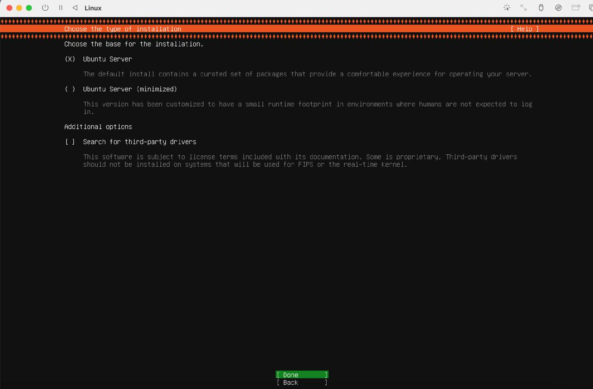

- Choose Ubuntu Server (leave as is)
- Done

#### 5. Network Configuration


- Leave as is
- Done

#### 6. Proxy Address
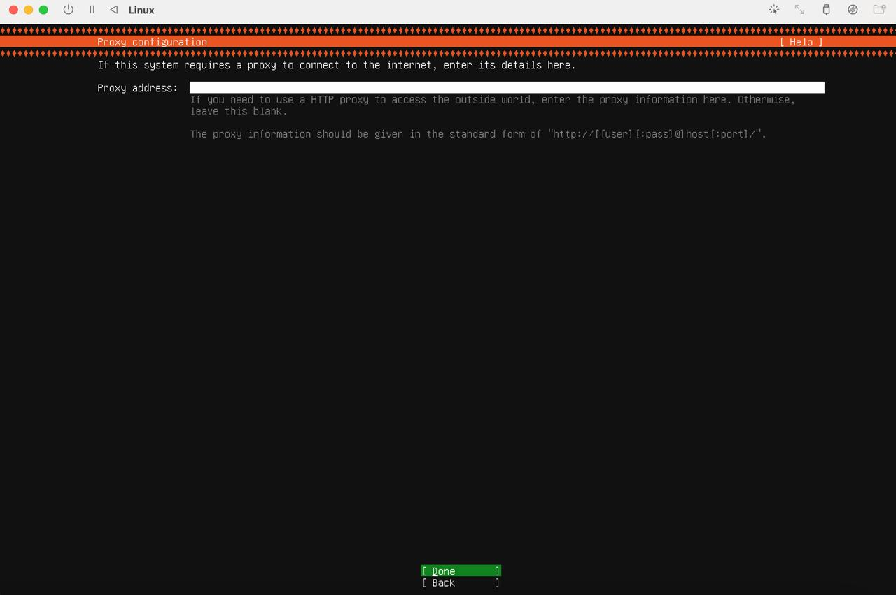

- Leave blank
- Done

#### 7. Ubuntu Config


- Will load some packages
- when it says Reading package list... ; Select Done

#### 8. Storage Config
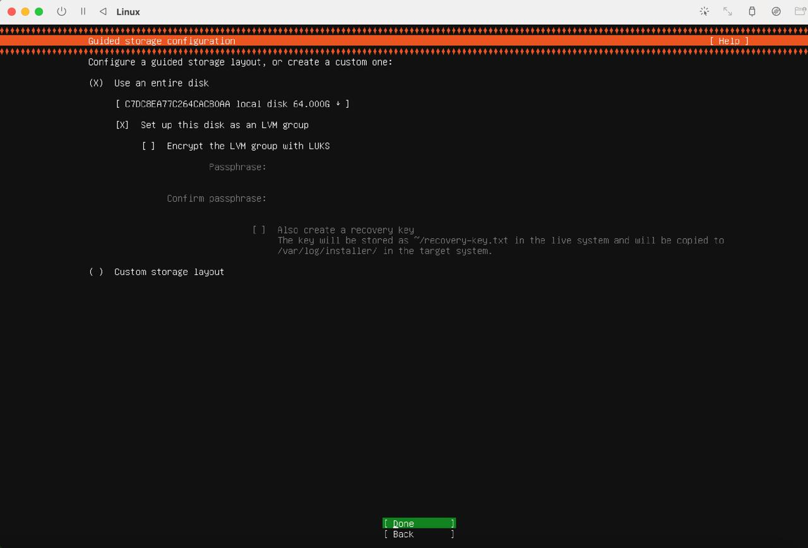

- Leave as is
- Done

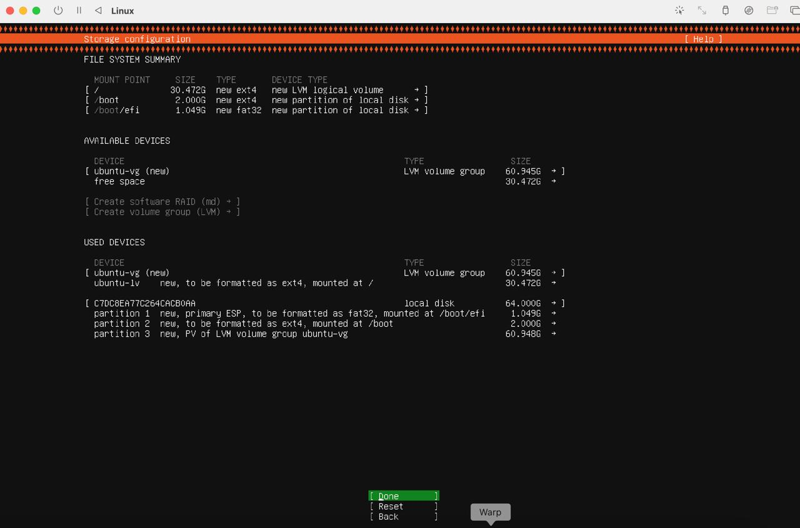

- Done
- Warning will appear. This warning only applies to the virtual disk inside the VM, not to your disk from your real device. You can continue without worries

#### 9. Create User
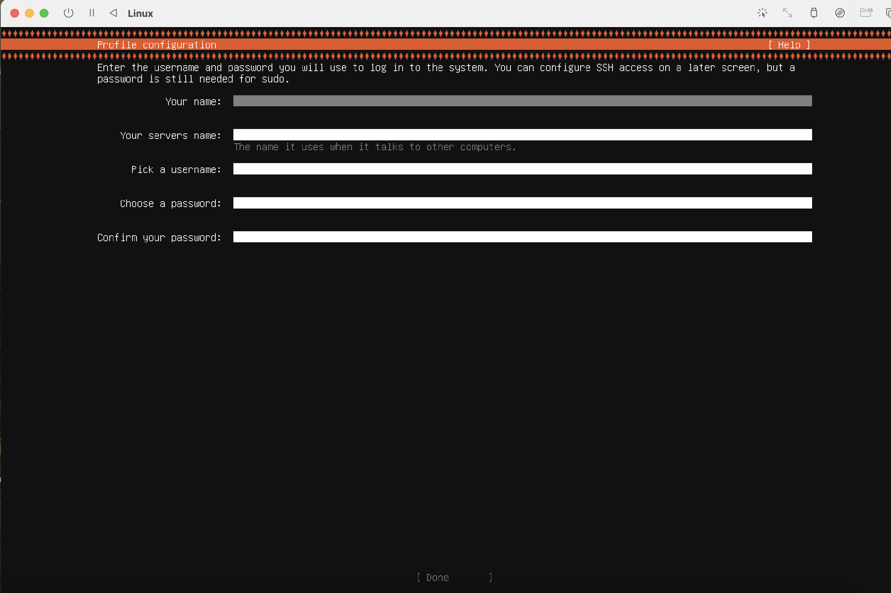

- Create a user for your Ubuntu VM
- You will need the username and password to log into the VM when you start it and when you do administrative tasks. Pick a password thats safe and you remeber.
- Done

#### 10. Upgrade Ubuntu
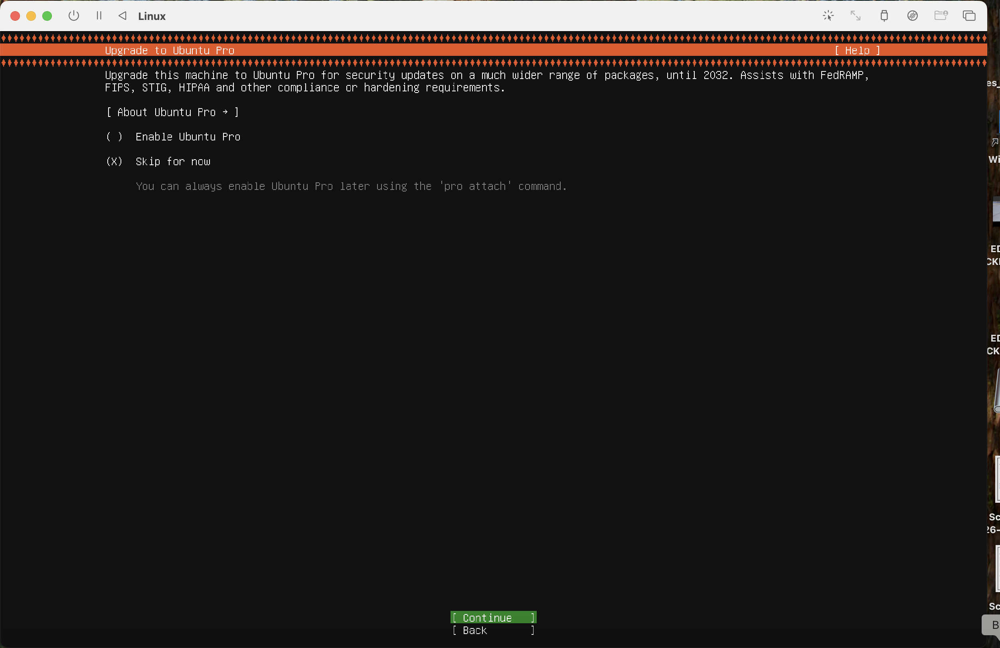

- You don't need to upgrade, leave as is
- Done

#### 11. SSH Configuration
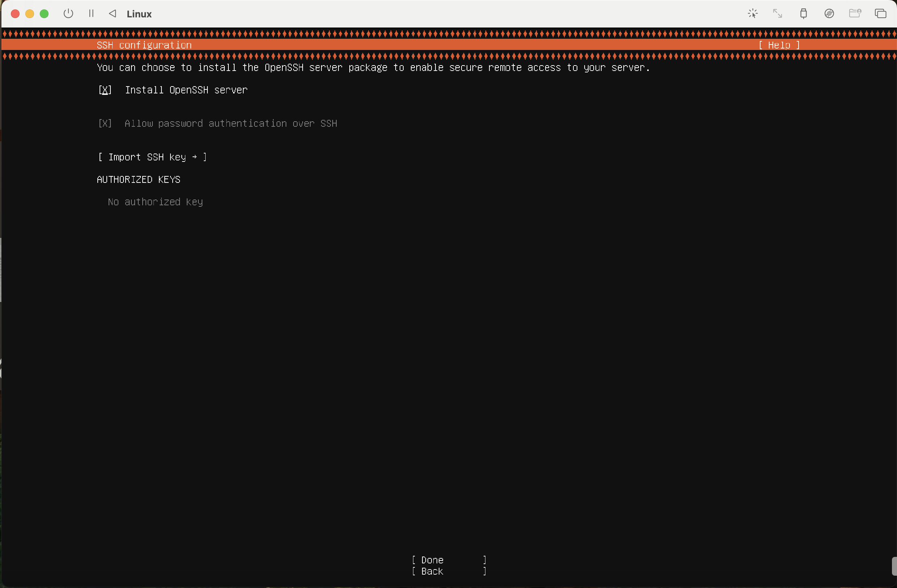

- Select install OpenSSH server
- Done

#### 12. Feature Server Snaps
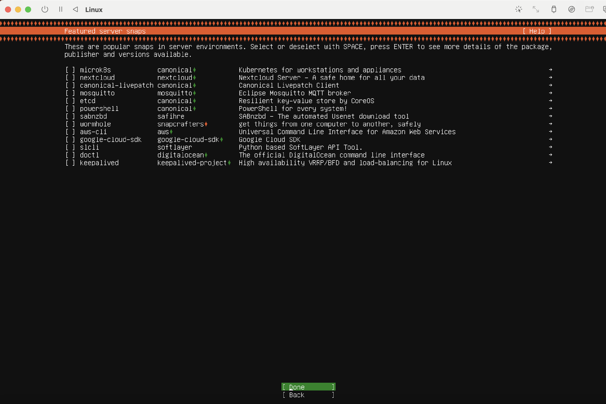

- You don't need any feature server snaps
- Done

#### 13. Installation
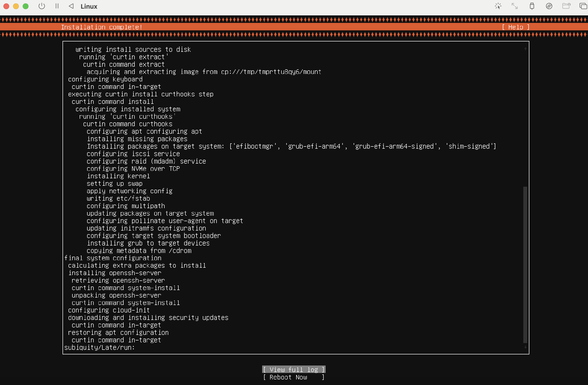

- An installation window will start
- Wait until it says Installation complete!
- Select Reboot
- Reboot will get stuck because .iso file is still attached
- Shut down VM with shut down symbol on top left

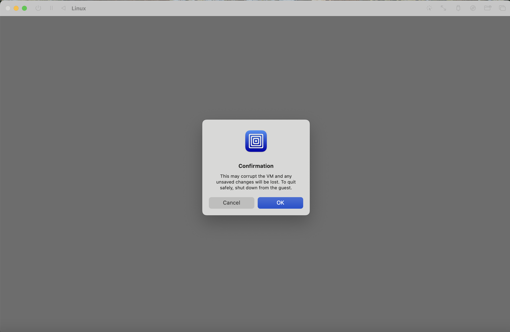

- Warning will appear
- Click OK

#### 14. Remove ISO Image
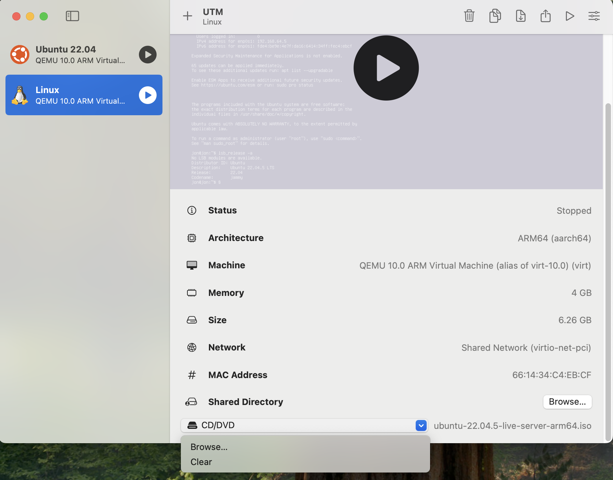

- Choose your VM that you just installed
- Scroll down and click on CD/DVD
- Click clear
- Restart VM by clicking on play symbol

#### 15. Restart VM

- Restart VM by clicking on play symbol
- A boot image will apear and after it will say Display output is not active
- Wait for 10 - 20 seconds
- Terminal will apear


- Use your username and password to login


- Congratulation, you now have a Ubuntu 22.04.5 VM on your macOS!
